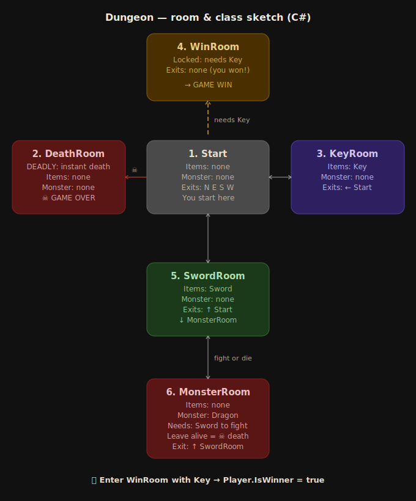

# Dungeon Text Adventure

A small text-based dungeon adventure game built in C# as part of a group assignment focused on **software testing**.

## About the game

The player navigates through **6 rooms** in a dark dungeon, picks up items, fights monsters and tries to reach the treasure without dying. The difficulty is medium — wrong choices lead to death, but the path is logical once you explore.

**Win condition:** collect the `GoldenKey` from the Crypt, defeat the Troll in the MonsterRoom using the `Sword`, then unlock and enter the TreasureRoom.

**Lose conditions:**
- Entering the MonsterRoom without a Sword → instant death
- Running out of HP (trap in PillarHall deals -10 HP on entry)

## Room map & class sketch

## Project structure

| Class | Responsibility |
|---|---|
| `Item` | Represents a pickable object (weapon, key, potion) |
| `Monster` | Enemy in a room, may require a weapon to defeat |
| `Room` | A dungeon room with items, a monster, exits and an optional trap |
| `Inventory` | Holds the player's items, exposes `HasWeapon()` and `HasKey()` |
| `Player` | Tracks HP, current room, inventory and win/alive state |
| `Game` | Orchestrates the game loop: move, pick up, fight, check game over |

## Testing focus

This project emphasises testing over gameplay complexity:

- **Unit tests** — isolated tests for `Inventory`, `Room`, `Item`, `Monster`
- **Integration tests** — verify cooperation between `Player`, `Room` and `Game`
- **BDD / Gherkin** — full scenario tests: win path, lose without sword, trap damage

## Tech

- Language: **C#**
- Test framework: **NUnit / xUnit**
- BDD: **SpecFlow** (Gherkin)
